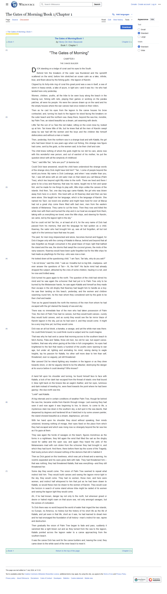

# Automated Book Publication Workflow



## Project Overview

The **Automated Book Publication Workflow** is a modular, agentic pipeline for scraping, spinning, reviewing, and publishing book chapters using AI (Groq, Gemini, or OpenAI), RL-based feedback, semantic versioning, and a human-in-the-loop UI. The system automates and optimizes the book publishing process with full traceability and voice support.

## Objectives
- Scrape book chapters and screenshots from the web
- Rewrite (spin) chapters using LLMs (Groq, Gemini, or OpenAI)
- Review and edit AI-generated content with LLMs
- Collect human feedback and apply RL-based reward loops
- Store and search chapter versions with ChromaDB and semantic embeddings
- Provide a Gradio UI for human-in-the-loop editing, review, and RL feedback
- Support voice input/output for accessibility

## Tools & Technologies
- **Playwright**: Web scraping and screenshot capture
- **Groq, Gemini, or OpenAI LLMs**: For AI-powered text rewriting and review
- **ChromaDB**: For versioning and semantic search
- **Gradio**: Interactive web UI
- **Reinforcement Learning Loop**: Reward-based optimization using human feedback
- **Google Speech-to-Text & Text-to-Speech, pyttsx3**: Voice feedback and audio playback

## Installation
1. Clone the repository:
   ```sh
   git clone <your-repo-url>
   cd automated-book-workflow
   ```
2. Install Python dependencies:
   ```sh
   pip install -r requirements.txt
   playwright install
   ```
3. Set up environment variables in a `.env` file:
   ```env
   GROQ_API_KEY=your_groq_api_key
   GOOGLE_API_KEY=your_google_api_key
   GOOGLE_APPLICATION_CREDENTIALS=path_to_your_google_credentials.json
   ```
4. (Optional) For voice features, ensure your system has a microphone and speakers.

## Usage
### 1. Scrape a Chapter
Run the scraper to fetch a chapter and screenshot:
```sh
python scraping/fetch_chapter.py
```


### 2. Spin the Chapter with AI
Rewrite the chapter using your configured LLM (Groq, Gemini, or OpenAI):
```sh
python ai_writer/spin_chapter.py
```

### 3. Review the AI-Generated Chapter
Send the spun chapter for review:
```sh
python ai_reviewer/review_chapter.py
```

### 4. Store and Search Versions in ChromaDB
Add and search chapter versions:
```sh
python versioning/chromadb_store.py
```

### 5. Use the Gradio UI (Human-in-the-Loop, RL Feedback)
Launch the interactive UI:
```sh
python ui/gradio_interface.py
```

### 6. Voice Support (Optional)
Transcribe and playback chapters with voice:
```sh
python voice_support/speech_to_text.py
```

## Demo


1. The workflow scrapes a chapter and saves both the text and a screenshot.
2. The chapter is spun by an LLM (Groq, Gemini, or OpenAI) and reviewed by another LLM or a human.
3. Feedback is collected and used to update the RL reward model.
4. All versions are stored in ChromaDB for semantic search and retrieval.
5. The Gradio UI allows users to interact with every stage, including RL feedback and versioning.
6. Voice support enables TTS and STT for accessibility.

---

**Note:**
- Ensure all API keys and credentials are set up before running the workflow.
- For best results, use a GPU-enabled machine for LLM and TTS/STT tasks.
- See each script for more details and customization options.
- RL reward and versioning are fully integrated in the UI.
